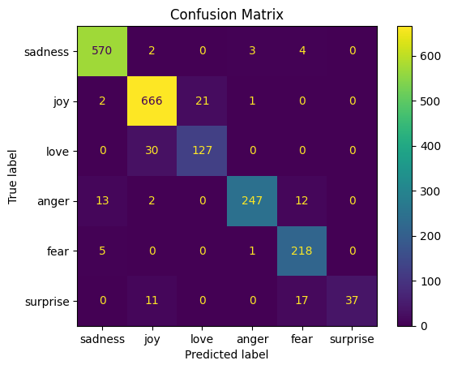

# Emotiondet

## Install

1. Clone Repository
   
   ```
   git clone https://github.com/ShihHsuanChen/emotiondet
   cd emotiondet 
   ```

2. Install `uv`

   ```
   pip install uv
   ```

   See https://docs.astral.sh/uv/getting-started/installation/#standalone-installer for more options

3. Install Dependencies

   ```
   uv sync
   ```

4. Acitvate the Environment
   
   ```
   source .venv/bin/activate
   ```

5. Install PyTorch with GPU Support (Optional)

   See https://pytorch.org/get-started/previous-versions/

   ROCM 6.1 (Linux only)

   ```shell
   uv pip install torch==2.6.0 torchvision==0.21.0 torchaudio==2.6.0 --index-url https://download.pytorch.org/whl/rocm6.1
   ```

   ROCM 6.2.4 (Linux only)

   ```
   uv pip install torch==2.6.0 torchvision==0.21.0 torchaudio==2.6.0 --index-url https://download.pytorch.org/whl/rocm6.2.4
   ```

   CUDA 11.8

   ```
   uv pip install torch==2.6.0 torchvision==0.21.0 torchaudio==2.6.0 --index-url https://download.pytorch.org/whl/cu118
   ```

   CUDA 12.4

   ```
   uv pip install torch==2.6.0 torchvision==0.21.0 torchaudio==2.6.0 --index-url https://download.pytorch.org/whl/cu124
   ```

   CUDA 12.6

   ```
   uv pip install torch==2.6.0 torchvision==0.21.0 torchaudio==2.6.0 --index-url https://download.pytorch.org/whl/cu126
   ```

6. Configuration

   1. Copy `.env.example` to `.env`
   2. Modify `DEVICE` depending on your GPU device. Accept values: "cpu", "cuda", "cuda:0", ...
   

## Run Application

### Simply Run

```
uvicorn main:app
```

### Assign Host and Port

```
uvicorn main:app --host <host> --port <port>
```

After server up, go to your browser and type the url in the search bar. For example, `127.0.0.0:8000`.
You can also checkout `127.0.0.1:8000/docs` for the API documentations.


## Model

### Training
- Code: [Training Notebook](https://www.kaggle.com/code/shihhsuanchen/emotion-detection-train)
- Criteria: Best validation loss
- Training configuration:

  ```json
  {
    "seed": 567,
    "ddp": true,
    "learning_rate": 5e-05,
    "train_batch_size": 80,
    "valid_batch_size": 80,
    "lr_scheduler_type": "linear",
    "num_epochs": 20,
    "num_warmup_steps": 125,
    "max_train_steps": null,
    "max_valid_steps": null,
    "max_length": 72
  }
  ```
  
### Evaluation
- Code: [Evaluation Notebook](https://www.kaggle.com/code/shihhsuanchen/emotion-detection-eval)
- Results
  
    | 	        |  sadness |   joy    |   love   |   anger  |   fear   | surprise | Total (Macro) |
    |-----------|----------|----------|----------|----------|----------|----------|---------------|
    | Accuracy  | 0.985420 | 0.965309 | 0.974359 | 0.983912 | 0.980392 | 0.985923 | 0.979219      |
    | Precision | 0.966102 | 0.936709 | 0.858108 | 0.980159 | 0.868526 | 1.000000 | 0.934934      |
    | Recall    | 0.984456 | 0.965217 | 0.808917 | 0.901460 | 0.973214 | 0.569231 | 0.867083      |
    | F1-Score  | 0.975192 | 0.950749 | 0.832787 | 0.939163 | 0.917895 | 0.725490 | 0.890213      |

    
